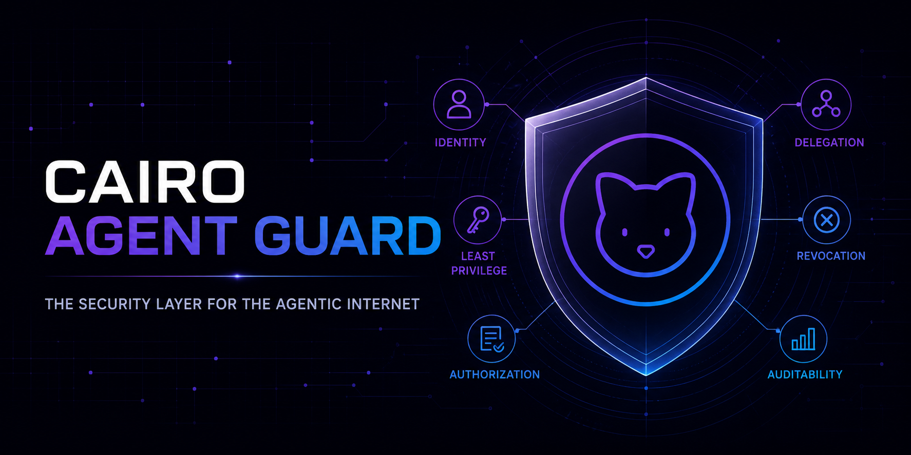
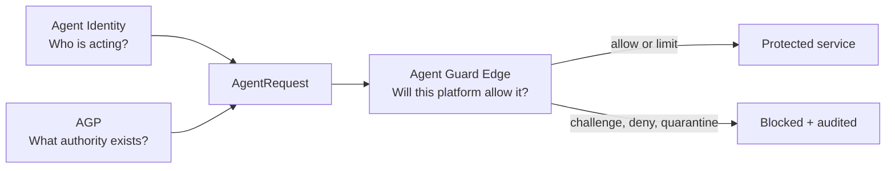
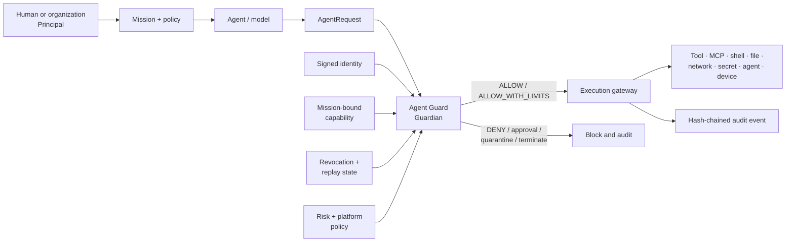
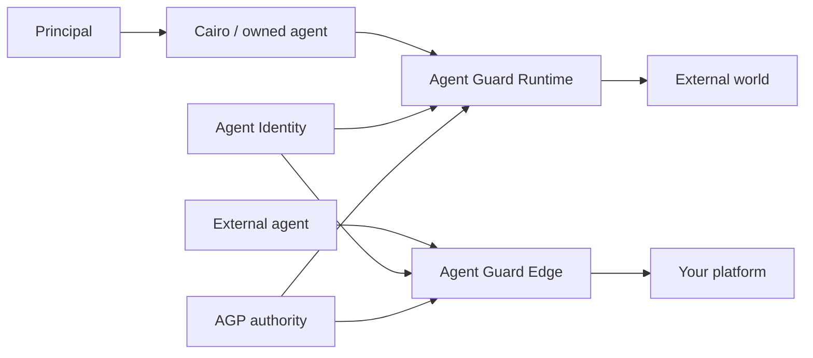
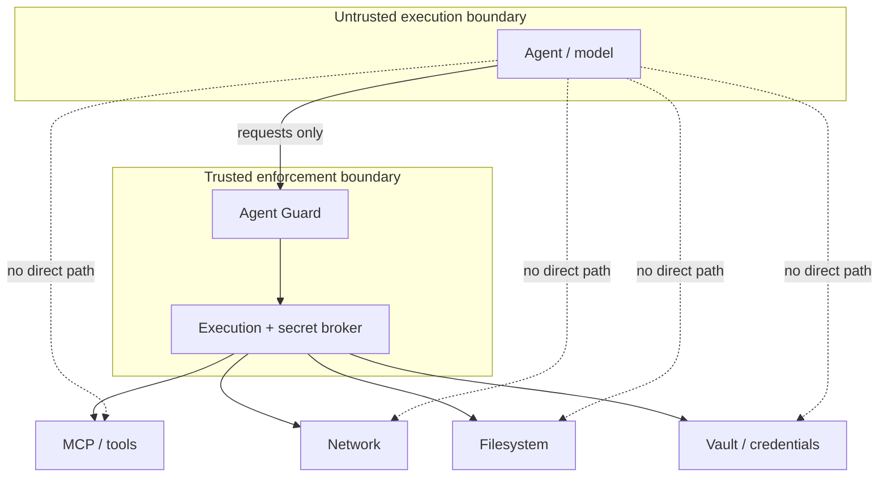

# Cairo Agent Guard



<p align="center">
  <strong>The zero-trust security layer for the Agentic Internet.</strong><br>
  Agent Identity, Agent Guard Protocol, and Agent Guard Edge for trustworthy autonomous systems.
</p>

<p align="center">
  <a href="docs/IDENTITY-INTEGRATION.md"></a>
  <a href="spec/AGP-v0.1.md"></a>
  <a href="docs/AGENT-GUARD-EDGE.md"></a>
  <a href="https://www.python.org/downloads/"></a>
  <a href="LICENSE"></a>
  
</p>

> **Intelligence is not authority.** Every consequential agent action must be
> explicitly authorized, narrowly bounded, independently enforced, observable,
> and revocable.

Cairo Agent Guard is a three-part security stack for software agents,
multi-agent systems, MCP ecosystems, enterprise platforms, and physical AI.

**Agent Identity** establishes a signed claim about which agent is acting and
which principal it represents. **Agent Guard Protocol (AGP)** expresses
mission-bound authority.

**Agent Guard Edge** protects receiving platforms by verifying, classifying,
constraining, challenging, or blocking autonomous actors before they reach
valuable resources.

The repository contains the draft protocol, identity authority and verification
flow, Edge architecture, and runnable Python runtime and daemon.

It also contains Python and TypeScript clients, an MCP policy proxy, Cairo
execution-gateway contract, JSON Schemas, certification profiles, deployment
guidance, threat model, and a site intended for
**[Cairo.sh/AgentGuard](https://cairo.sh/AgentGuard)**.

## Contents

- [Why Agent Guard](#why-agent-guard)
- [The three pillars](#the-three-pillars)
- [The security model](#the-security-model)
- [Agent Identity](#agent-identity)
- [How it works](#how-it-works)
- [What ships in V0.1](#what-ships-in-v01)
- [Agent Guard Protocol](#agent-guard-protocol-agp)
- [Authorization and risk](#authorization-and-risk)
- [Agent Guard Edge](#agent-guard-edge)
- [Architecture](#architecture)
- [Quick start](#quick-start)
- [End-to-end authorization](#end-to-end-authorization)
- [SDKs and integrations](#sdks-and-integrations)
- [Agent certification](#agent-certification)
- [Deployment and non-bypassability](#deployment-and-non-bypassability)
- [Security and known limitations](#security-and-known-limitations)
- [Open-source and commercial boundary](#open-source-and-commercial-boundary)
- [Roadmap](#roadmap)
- [Project status](#project-status)
- [Contributing and security reports](#contributing-and-security-reports)

## Why Agent Guard

Agentic systems cross a security boundary that conventional application controls
were not designed to govern.

An agent can interpret untrusted content, plan over long horizons, select tools,
create sub-agents, use credentials, mutate systems, and continue operating after
the original user interaction ends.

A prompt, model policy, or tool description is therefore insufficient as an
authorization system.

Agent Guard addresses the gap by separating two concerns:

- **Intelligence** decides what an agent would like to do.
- **Authority** determines what that specific agent may do, for which principal,
  within which mission, against which resource, for how long, and at what risk.

The model never grants itself authority. Retrieved text, a website, an email, a
tool response, another agent, or prompt injection cannot enlarge a signed
capability.

Policy is evaluated by a Guardian outside the model's control boundary. The host
performs the operation only after an explicit decision.

## The three pillars

Agent Guard is broader than AGP. The protocol is the shared language inside a
larger identity and enforcement system.

| Pillar | Core question | Role |
|---|---|---|
| **Agent Identity** | Who is acting, and for whom? | Signed identity, principal binding, issuer trust, lifecycle, rotation, revocation, and agent-aware audit. |
| **Agent Guard Protocol** | What authority was granted? | Portable missions, capabilities, delegation, risk, decisions, incidents, attestations, and revocations. |
| **Agent Guard Edge** | Will this platform accept the action? | Receiving-side discovery, verification, local policy, challenge, rate control, DLP, isolation, quarantine, and evidence. |



The three pillars can be adopted together or incrementally. Their security
properties are strongest when identity, portable authority, and non-bypassable
enforcement are all present.

## The security model

Agent Guard is built around six invariants:

1. **Default deny** — missing, invalid, expired, replayed, or mismatched authority
   resolves to `DENY`.
2. **Mission binding** — identity and capability are bound to the same agent,
   principal, and active mission.
3. **Least privilege** — a grant names the allowed resources, actions, risk
   ceiling, expiration, and delegation depth.
4. **Monotonic delegation** — a child can receive less authority than its parent,
   never more.
5. **Risk only tightens** — risk can require approval, quarantine, terminate, or
   deny an otherwise valid action; it cannot create permission.
6. **Revocation propagates** — identities, missions, capabilities, agents, and
   delegated subtrees can be stopped without waiting for token expiry.

This produces a simple operational rule:

```text
No signed identity
  or no active mission
  or no matching capability
  or a revoked/replayed request
  or an unacceptable risk
      = no side effect
```

## Agent Identity

Agent Identity makes an autonomous actor a distinct, verifiable security
subject. It binds a stable `agent_id` to the human or organization represented
by `principal_id`, under a trusted issuer and signing key.

V0.1 verifies the issuer's signed identity claim. Proof that the current
presenter controls that agent requires request-envelope proof-of-possession,
which remains next-protocol work.

A complete identity system covers more than token issuance:

```text
Register → prove principal authority → issue → present → verify
         → authorize → rotate → revoke or retire
```

Receiving platforms verify issuer, key, signature, lifetime, agent and principal
binding, and revocation before evaluating mission and capability.

Identity is not permission. A verified customer-support agent remains unable to
delete a cloud deployment unless a matching capability and local policy both
allow that exact action.

V0.1 implements the local signed-identity foundations summarized in the
[implementation status](docs/IDENTITY-INTEGRATION.md#current-implementation-status).

Managed CA, federation, public discovery, hardware-backed identity, remote
attestation, and a global agent registry remain roadmap capabilities.

Read the complete [Agent Identity integration guide](docs/IDENTITY-INTEGRATION.md).

## How it works



For each consequential action:

1. The platform creates an `AgentRequest` containing the agent, principal,
   mission, exact resource and action, signed tokens, session, one-time request
   identifiers, nonce, timestamp, and risk score.
2. The Guardian verifies token signatures and expiry.
3. It proves the request's agent and principal match both signed documents.
4. It checks that the mission is active and principal-bound.
5. It checks resource/action scope, risk ceiling, replay state, revocation state,
   and delegated ancestry.
6. It emits one deterministic `AgentDecision` and an audit event.
7. The execution gateway performs the operation only for `ALLOW` or
   `ALLOW_WITH_LIMITS`.

## What ships in V0.1

The current repository is executable, not only a design document:

- signed, expiring `AgentIdentity` documents with issuer and key identifiers;
- a documented Agent Identity lifecycle, issuer trust model, and platform
  integration profile;
- principal-bound mission registration and immediate termination;
- signed, mission-bound `AgentCapability` tokens;
- conservative wildcard resource matching and explicit action scopes;
- capability delegation with subset, risk, expiry, and depth enforcement;
- parent-capability revocation that invalidates delegated descendants;
- identity, agent, mission, and capability revocation;
- delegated-agent graph registration and subtree quarantine;
- deterministic default-deny policy and risk-driven tightening;
- one-time request IDs, nonces, timestamp freshness, and replay rejection;
- a mandatory execution gateway that blocks before invocation;
- an MCP JSON-RPC `tools/call` policy proxy and blocking demonstration;
- receiving-side Edge reference primitives for identity and authority
  verification, enforcement ordering, revocation, quarantine, and evidence;
- blind secret execution with response scrubbing;
- SQLite-backed runtime state and JSONL hash-chained audit evidence;
- a dependency-free local HTTP daemon and Python client;
- a TypeScript SDK and Cairo host-integration contract;
- durable certification application intake;
- JSON Schemas for every core AGP protocol object;
- a static product and developer documentation site; and
- conformance-oriented tests for protocol, runtime, gateway, MCP, secrets,
  certification, audit concurrency, HTTP, SDK, schemas, and website behavior.

## Agent Guard Protocol (AGP)

AGP is the open trust and control protocol connecting identities, runtimes,
Edge gateways, resource servers, authorization services, and auditors.

It defines a shared vocabulary across agents and platforms. AGP is one pillar
of Agent Guard; it does not replace identity lifecycle or Edge enforcement.

| Object | Purpose |
|---|---|
| `AgentIdentity` | Signed statement of which agent acts for which principal. |
| `AgentPassport` | Portable trust, provenance, and certification metadata. |
| `AgentMission` | Principal-approved objective, lifetime, and policy boundary. |
| `AgentCapability` | Narrow, expiring permission over resources and actions. |
| `AgentDelegation` | Parent-to-child authority transfer with monotonic reduction. |
| `AgentRequest` | Complete authorization envelope for one consequential action. |
| `AgentDecision` | Deterministic effect, reason, request, and capability reference. |
| `AgentAttestation` | Evidence about runtime, build, sandbox, policy, and workload. |
| `AgentRisk` | Structured security risk used only to tighten decisions. |
| `AgentIncident` | Machine-readable security or safety event. |
| `AgentRevocation` | Immediate invalidation of an authority-bearing subject. |
| `HumanAuthorization` | Exact, time-bound, single- or limited-use approval envelope. |

The normative draft is [AGP v0.1](spec/AGP-v0.1.md); machine-readable contracts
live in [`schemas/`](schemas/).

## Authorization and risk

AGP defines ten effects so a platform can express more than a binary allow/deny:

| Effect | Meaning |
|---|---|
| `ALLOW` | Perform the requested operation. |
| `ALLOW_WITH_LIMITS` | Perform it under returned constraints. |
| `REQUIRE_APPROVAL` | Block until an exact, trusted human approval is available. |
| `SANITIZE` | Remove or transform unsafe input/output before continuing. |
| `REDIRECT` | Route the action to a safer resource or workflow. |
| `RATE_LIMIT` | Delay or cap repeated activity. |
| `ISOLATE` | Move execution into a stronger containment boundary. |
| `QUARANTINE` | Stop the agent and contain its delegated subtree. |
| `DENY` | Refuse the action. |
| `TERMINATE` | End the run and revoke relevant authority. |

The V0.1 reference Guard currently maps authorized requests using these risk
thresholds:

| Risk score | Reference outcome |
|---:|---|
| `0–50` | `ALLOW`, provided the capability's own `max_risk` is not exceeded. |
| `51–70` | `REQUIRE_APPROVAL` and fail closed in the current runtime. |
| `71–90` | `QUARANTINE`. |
| `91–100` | `TERMINATE`. |
| Outside `0–100` | `DENY`. |

Deployments may apply stricter thresholds. They must never use risk to widen a
resource, action, mission, principal, agent, time, or delegation boundary.

The normative AGP default bands describe `26–50` as constrained. The current
Guard does not yet emit `ALLOW_WITH_LIMITS` for that band, so this is an explicit
V0.1 conformance gap rather than a claim that the protocol changed.

## Agent Guard Edge

Agent Guard Edge protects the receiving platform from agents operated by other
teams, tenants, vendors, or autonomous systems.

It sits before APIs, SaaS, MCP servers, data platforms, commerce, cloud, and
devices. Edge converts an inbound request into a canonical `AgentRequest`, then
intersects signed agent authority with the platform's own policy.

```text
External autonomous actor
            │
            ▼
AGENT GUARD EDGE
Discover → Verify → Classify → Authorize → Enforce → Audit
            │
            ▼
API · SaaS · MCP · Data · Commerce · Cloud · Device
```

Edge recognizes six useful trust states:

| State | Treatment |
|---|---|
| `VERIFIED` | Continue to mission, capability, and local-policy checks. |
| `CONSTRAINED` | Permit only narrower routes, methods, budgets, or data. |
| `CHALLENGED` | Require stronger identity, attestation, or exact approval. |
| `UNKNOWN` | Deny sensitive access or isolate to a low-trust surface. |
| `REVOKED` | Deny and emit a linked security event. |
| `HOSTILE` | Deny, quarantine, and propagate threat intelligence. |

Deployment patterns include reverse proxy, API-gateway policy module, MCP
gateway, service-mesh sidecar, SaaS agent ingress, and physical-system gateway.

The V0.1 codebase provides Edge building blocks, not yet a managed distributed
Edge service. Global enforcement, distributed replay defense, adaptive behavior
detection, semantic DLP, SIEM/SOAR, HA, and SLAs remain platform work.

Read the complete [Agent Guard Edge architecture](docs/AGENT-GUARD-EDGE.md).

## Architecture

Agent Guard secures both directions of agent interaction:



- **Runtime** protects other systems from an agent you operate.
- **Edge** protects your systems from agents operated elsewhere.
- **Identity** and **AGP** give both boundaries the same verifiable context.

```text
User / enterprise policy
          │
          ▼
Cairo mission planner
          │  identity + principal + mission + policy hash
          ▼
Agent / model process (untrusted)
          │  proposed consequential action
          ▼
Agent Guard Kernel / Guardian (outside model authority)
          │
          ├── identity and capability verification
          ├── mission, revocation, delegation, replay, and risk checks
          ├── deterministic decision
          └── append-only audit evidence
          │
          ▼
Mandatory execution gateway
          │
          └── MCP · tools · shell · filesystem · network · secrets
              delegation · purchases · cloud · PAIP / physical systems
```

### Repository map

```text
cairo-agent-guard/
├── spec/AGP-v0.1.md             # protocol specification
├── schemas/                     # JSON Schemas for AGP objects
├── src/agentguard/              # Python kernel, runtime, daemon, and SDK
├── packages/sdk-ts/             # dependency-free TypeScript client
├── integrations/cairo/          # Cairo mandatory gateway contract
├── integrations/mcp/            # MCP Guard integration guidance
├── docs/IDENTITY-INTEGRATION.md # Agent Identity lifecycle and integration
├── docs/AGENT-GUARD-EDGE.md     # receiving-side Edge architecture
├── docs/                         # API, deployment, roadmap, and certification
├── security/                     # threat model and disclosure policy
├── examples/                     # runnable policy and MCP demonstrations
├── tests/                        # conformance and regression tests
└── website/                      # static Cairo.sh/AgentGuard experience
```

## Quick start

### Requirements

- Python 3.11 or newer
- Git
- Node.js 20+ and pnpm only if developing the TypeScript SDK

The Python reference runtime has no third-party runtime dependencies.

### 1. Clone and install

```bash
git clone https://github.com/ColomboAI-com/cairo-agent-guard.git
cd cairo-agent-guard
python -m pip install -e .
```

### 2. Configure local authority secrets

Use distinct high-entropy values of at least 32 characters. Never place these
values in a prompt, agent context, source file, or browser client.

PowerShell:

```powershell
$env:AGENTGUARD_SIGNING_KEY = "replace-with-at-least-32-random-bytes"
$env:AGENTGUARD_OPERATOR_TOKEN = "use-a-different-32-character-random-token"
$env:AGENTGUARD_DATA_DIR = ".agentguard"
```

POSIX shell:

```bash
export AGENTGUARD_SIGNING_KEY="replace-with-at-least-32-random-bytes"
export AGENTGUARD_OPERATOR_TOKEN="use-a-different-32-character-random-token"
export AGENTGUARD_DATA_DIR=".agentguard"
```

Optional settings are `AGENTGUARD_ISSUER`, `AGENTGUARD_HOST`, and
`AGENTGUARD_PORT`. The default listener is `127.0.0.1:8787`.

### 3. Start the daemon

```bash
agentguardd
```

Check liveness from another terminal:

```bash
curl http://127.0.0.1:8787/healthz
```

Authority and control-plane routes require:

```http
Authorization: Bearer <AGENTGUARD_OPERATOR_TOKEN>
```

Do not expose issuance, revocation, quarantine, mission administration, or audit
administration directly to untrusted agents. Remote deployments need
authenticated ingress and preferably mTLS.

### 4. Run the conformance tests

```bash
python -m pip install pytest
python -m pytest -q
```

### 5. See an unauthorized MCP call blocked

```bash
python examples/mcp_guard_demo.py
```

The proxy maps `tools/call` to `mcp://<server>/<tool>` and calls the upstream MCP
transport only after an allowed Agent Guard decision.

## End-to-end authorization

The Python client exposes both operator and runtime surfaces. This abbreviated
flow registers a mission, issues identity and capability, and asks the Guardian
to authorize one CRM tool call:

```python
from datetime import UTC, datetime, timedelta

from agentguard.client import AgentGuardClient

base_url = "http://127.0.0.1:8787"
operator = AgentGuardClient(
    base_url,
    operator_token="use-a-different-32-character-random-token",
)
guard = AgentGuardClient(base_url)

now = datetime.now(UTC)
expires = (now + timedelta(minutes=15)).isoformat().replace("+00:00", "Z")

operator.register_mission(
    mission_id="mission://support-7",
    principal_id="org://acme",
    expires_at=expires,
)

identity = operator.issue_identity(
    agent_id="agp://cairo/support-01",
    principal_id="org://acme",
    expires_at=expires,
)

capability = operator.issue_capability(
    agent_id="agp://cairo/support-01",
    principal_id="org://acme",
    mission_id="mission://support-7",
    resources=["mcp://crm/read_customer"],
    actions=["invoke"],
    max_risk=40,
    expires_at=expires,
    delegation_depth=1,
)

decision = guard.authorize({
    "request_id": "req-01-unique",
    "agent_id": "agp://cairo/support-01",
    "principal_id": "org://acme",
    "mission_id": "mission://support-7",
    "resource": "mcp://crm/read_customer",
    "action": "invoke",
    "identity_token": identity["token"],
    "capability_token": capability["token"],
    "session_id": "session-01",
    "nonce": "nonce-01-one-time-random-value",
    "risk_score": 12,
    "timestamp": now.isoformat().replace("+00:00", "Z"),
})

if decision["effect"] not in {"ALLOW", "ALLOW_WITH_LIMITS"}:
    raise RuntimeError(f"Blocked by Agent Guard: {decision}")
```

The same request ID or nonce must not be reused. Stopping a mission or revoking
the capability causes subsequent requests to fail immediately.

### HTTP surface

| Method | Path | Purpose | Operator auth |
|---|---|---|:---:|
| `GET` | `/healthz` | Liveness and AGP version | No |
| `POST` | `/v1/identities/issue` | Issue signed identity | Yes |
| `POST` | `/v1/identities/verify` | Verify identity | No |
| `POST` | `/v1/missions` | Register active mission | Yes |
| `POST` | `/v1/missions/terminate` | End mission immediately | Yes |
| `POST` | `/v1/capabilities/issue` | Issue mission-bound authority | Yes |
| `POST` | `/v1/capabilities/delegate` | Create reduced child authority | Yes |
| `POST` | `/v1/authorize` | Evaluate one action | No |
| `POST` | `/v1/revocations` | Revoke a security subject | Yes |
| `POST` | `/v1/delegations` | Register agent graph edge | Yes |
| `POST` | `/v1/quarantine` | Revoke agent and descendants | Yes |
| `GET` | `/v1/audit` | Retrieve events and chain status | Yes |
| `POST` | `/v1/certification/applications` | Submit certification intake | No |

See the [daemon API guide](docs/API.md) for deployment notes.

## SDKs and integrations

### Python

The installable `agentguard` package includes:

- `AgentGuardClient` for HTTP integrations;
- `Guard` for deterministic in-process evaluation;
- `AgentGuardRuntime` for mission, replay, revocation, and audit orchestration;
- `ExecutionGateway` for authorize-before-execute call order;
- `MCPGuardProxy` for transport-neutral MCP mediation;
- identity and capability authorities;
- mission and revocation registries;
- audit, certification, and blind-secret components; and
- `agentguard` and `agentguardd` command-line entry points.

### TypeScript

The package in [`packages/sdk-ts`](packages/sdk-ts/) provides AGP request,
identity, decision, and effect types plus a dependency-free HTTP client:

```ts
import { AgentGuardClient } from "@cairo/agentguard";

const guard = new AgentGuardClient("http://127.0.0.1:8787");
const decision = await guard.authorize(request);

if (decision.effect !== "ALLOW" && decision.effect !== "ALLOW_WITH_LIMITS") {
  throw new Error(`Agent Guard blocked execution: ${decision.reason}`);
}
```

### Cairo Super Agent

Agent Guard is designed to sit beneath Cairo as a mandatory security substrate,
not as an optional prompt guardrail. The reference
[`CairoExecutionGateway`](integrations/cairo/cairo-agentguard-integration.ts)
mediates:

- MCP and native tools;
- shell execution;
- filesystem read, write, and delete;
- network origins and methods;
- brokered secret use; and
- delegation to child agents.

Every Cairo run carries an `agentId`, `principalId`, `missionId`, signed identity,
capability, session, policy-bundle hash, and risk score.

Direct executor handles must never be placed in model-controlled code. See the
[Cairo integration contract](integrations/cairo/README.md).

### MCP Guard

`MCPGuardProxy` intercepts MCP JSON-RPC `tools/call`, maps it to an AGP resource,
and calls upstream only on `ALLOW` or `ALLOW_WITH_LIMITS`.

A production adapter must also prevent the agent from opening a second,
unguarded connection to the MCP server. See
[MCP integration guidance](integrations/mcp/README.md).

### Agent identity for platforms

Platforms should treat Agent Identity as a complete lifecycle, not a header.
They must validate issuer, signature, expiry, principal binding, revocation,
mission, and capability—not merely accept an `Agent-ID` string.

The guide covers registration, issuance, presentation, verification, rotation,
revocation, trust policy, key management, privacy, and API/MCP integration:
[Agent Identity](docs/IDENTITY-INTEGRATION.md).

### Agent Guard Edge

Receiving platforms can use the runtime and SDKs as Edge foundations. Normalize
the inbound operation and verify Agent Identity and AGP authority.

A platform adapter must then apply the receiving platform's local policy and
forward only allowed or correctly limited actions. V0.1 does not ship a
configurable Edge policy evaluator.

The Edge guide covers trust states, the decision pipeline, data/control planes,
reverse-proxy and gateway patterns, challenges, DLP, and economic controls.

It also covers quarantine, operations, privacy, and product status:
[Agent Guard Edge](docs/AGENT-GUARD-EDGE.md).

## Agent certification

Agent Guard Certification is intended to make security claims measurable for
agents, runtimes, platforms, MCP servers, and physical systems.

| Level | Profile | Core evidence |
|---|---|---|
| **AGP-L1** | Identity Ready | Stable identity, principal binding, signed envelopes, revocation, disclosure process. |
| **AGP-L2** | Capability Controlled | L1 plus missions, default deny, monotonic delegation, expiry, auditable decisions. |
| **AGP-L3** | Runtime Protected | L2 plus non-bypassable tool/network/file/secret controls, DLP, quarantine, telemetry. |
| **AGP-L4** | High Assurance | L3 plus attestation, independent policy, tamper resistance, signed approvals, exercises. |
| **AGP-P** | Physical AI | L3/L4 plus PAIP command envelopes, independent safety control, physical limits, E-stop, replay protection. |

The intended assessment flow is:

```text
Apply → scope profile → submit evidence → automated conformance
      → adversarial validation for L3+ → remediate
      → signed certificate and registry → annual/material-change renewal
```

The V0.1 daemon accepts and durably stores certification applications. A
submission is an application, **not** a certificate or claim of conformance.
Read the [certification framework](docs/CERTIFICATION.md).

## Deployment and non-bypassability

The Python gateway guarantees authorize-before-execute ordering only inside a
trusted host process. A real security boundary also requires the surrounding
platform to remove alternate paths:

1. Run agent/model code in a sandboxed process, container, microVM, or VM.
2. Route egress through a default-deny proxy controlled by the Guardian.
3. Give tool transports and privileged filesystem handles only to the Guardian.
4. Keep credentials in an external vault and expose broker operations, not raw
   secret values.
5. Bind workload identity to the Guardian rather than model-generated code.
6. Put operator APIs behind authenticated ingress and preferably mTLS.
7. Ship audit events to remote append-only or WORM storage.
8. Exercise revocation, subtree quarantine, key rotation, fail-closed recovery,
   and Guardian outage procedures.



Read [Deployment and Non-Bypassability](docs/DEPLOYMENT.md) before treating the
runtime as a security control.

## Security and known limitations

### Threats addressed

The reference design directly models prompt injection, forged identity and
capability, replay, confused-deputy attacks, delegation escalation, and direct
tool or network bypass.

It also models credential theft, audit tampering, Guardian failure, and kill
evasion through descendants. Details are in the
[V0.1 threat model](security/THREAT-MODEL.md).

### Explicit V0.1 limitations

This is a draft reference implementation, not a production-hardening claim:

- the local issuer uses HMAC rather than asymmetric keys or HSM custody;
- runtime state is local SQLite and audit evidence is local JSONL;
- replay state is not distributed across replicas;
- the package does not configure kernel, container, network, or cloud isolation;
- production mTLS, SSO/RBAC, high availability, and remote immutable storage are
  deployment responsibilities;
- proof-of-possession over the complete request envelope remains next-protocol
  conformance work; and
- cryptographic `HumanAuthorization` consumption is not yet implemented.
  `REQUIRE_APPROVAL` therefore blocks execution rather than accepting an
  unsigned approval.

For production use, adopt asymmetric signing, HSM-backed custody, authenticated
service identity, strongly consistent revocation, distributed replay defense,
remote immutable audit storage, and platform-native containment.

## Open-source and commercial boundary

The open foundation is intentionally broad:

- Agent Identity document, lifecycle, verification profile, and schemas;
- AGP specification and JSON Schemas;
- deterministic authorization runtime and conformance tests;
- Python and TypeScript SDKs;
- Agent Guard Edge architecture and reference enforcement interfaces;
- reference MCP and Cairo integrations;
- certification profiles and evidence requirements;
- examples, documentation, deployment guidance, and threat model.

The future managed platform can add managed Agent Identity CA and federation,
registry and discovery, global Agent Guard Edge, semantic DLP, behavioral and
escape detection, threat intelligence, and Agent SOC.

It can also add remote attestation, enterprise secret brokers, compliance
evidence, managed certification, high availability, and SLAs.

Identity, AGP, and the reference Edge interfaces remain useful without the
commercial control plane and are licensed under Apache-2.0.

## Roadmap

| Phase | Outcome |
|---|---|
| **0 — Foundation** | Agent Identity, AGP v0.1, Edge architecture, schemas, deterministic core, SDKs, Cairo contract, website, docs, certification UX. |
| **1 — Developer wedge** | Identity issuer/verifier, local daemon, policy compiler, MCP Guard, Edge adapter, audit stream, blind secrets. |
| **2 — Cairo-native enforcement** | Mandatory identity/mission per run, all consequential paths through the gateway, approvals, quarantine trees, Agent SOC. |
| **3 — Enterprise platform** | Managed Agent Identity, registry, global Agent Guard Edge, SSO/RBAC, DLP, behavior detection, SIEM/SOAR, attestation, evidence. |
| **4 — Ecosystem and certification** | Conformance suite, public registry, AGP-L1 through L4 and AGP-P, partner labs, threat exchange. |
| **5 — Physical AI** | PAIP binding, device identity, safety envelopes, operator authorization, fleet quarantine, hardware-backed safety. |

The detailed execution sequence is maintained in [ROADMAP.md](docs/ROADMAP.md).

## Project status

**Current release:** Cairo Agent Guard V0.1 foundation with draft AGP v0.1.

Implemented today: signed Agent Identity issuance and verification, the AGP
object model, deterministic evaluator, local runtime, daemon, SDKs, MCP adapter,
Cairo contract, and Edge enforcement foundations.

Schemas, documentation, certification intake, and tests are also included.

Remaining work includes managed Agent Identity, federation and registry,
production cryptography, and distributed Edge data and control planes.

Full request proof-of-possession, signed approvals, platform containment,
hosted services, public certification, `Cairo.sh/AgentGuard`, and direct Cairo
wiring also remain.

## Contributing and security reports

Contributions are welcome across protocol design, schemas, language SDKs,
runtime enforcement, MCP adapters, platform integrations, conformance testing,
documentation, and threat research.

- Review the [work plan](docs/WORK.md) and [roadmap](docs/ROADMAP.md).
- Keep protocol behavior deterministic and default-deny.
- Add tests for new authority, delegation, replay, revocation, or gateway paths.
- Never make model output, retrieved data, or prompt text an authorization
  channel.

Please do **not** open a public issue for a suspected vulnerability. Follow
[`SECURITY.md`](SECURITY.md) and the private
[security reporting policy](security/REPORTING.md).

## License

Copyright Cairo / ColomboAI contributors. Licensed under the
[Apache License 2.0](LICENSE).

---

<p align="center">
  <strong>Cairo Agent Guard</strong><br>
  Identity. Capability. Control. Evidence.
</p>
