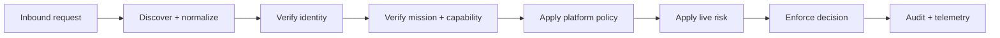

# Agent Guard Edge

**Protect your platform from autonomous agents.**

Agent Guard Edge is the receiving-side enforcement layer for APIs, SaaS,
MCP servers, data platforms, commerce, cloud services, and physical systems.

AGP describes portable trust and authority. Agent Identity proves who is
acting. Edge turns those signals into a local, enforceable platform decision.

> An agent's claim is input to policy, never permission to enter.

## Why Edge exists

Traditional gateways identify users, applications, and network clients. They
usually cannot determine whether a request came from an autonomous agent.

They also cannot answer which principal the agent represents, why it is acting,
which mission authorizes it, or whether a delegated capability is still valid.

Edge adds an agent-aware trust boundary in front of valuable resources. It can
recognize verified agents, constrain known agents, challenge unknown actors,
and block or quarantine hostile automation.

Edge is complementary to Agent Guard Runtime:

| Product | Security direction | Primary question |
|---|---|---|
| Agent Guard Runtime | Protects the world from an agent you operate. | May this agent perform this action? |
| Agent Guard Edge | Protects your platform from agents operated elsewhere. | Should this actor reach this resource? |

## Position in the Agent Guard stack

```text
External agent or multi-agent system
                │
                │ request + identity + mission + capability
                ▼
┌─────────────────────────────────────────────────────┐
│ AGENT GUARD EDGE                                    │
│                                                     │
│ Identify → Verify → Classify → Authorize → Enforce  │
│                      │                              │
│          Risk · DLP · Rate · Challenge              │
└─────────────────────────────────────────────────────┘
                │
                ▼
API · SaaS · MCP · Data · Commerce · Cloud · Device
```

The platform remains sovereign. A valid AGP capability proves what an issuer
granted; it does not force a receiving platform to honor that grant.

Edge intersects portable authority with local policy:

```text
effective access = signed agent authority ∩ receiving-platform policy
```

## Trust states

Edge classifies the actor before allowing a consequential operation.

| State | Meaning | Typical treatment |
|---|---|---|
| `VERIFIED` | Trusted issuer, valid identity, current revocation state. | Continue to mission and capability checks. |
| `CONSTRAINED` | Verified actor under narrower local limits. | Allow selected routes, budgets, or methods. |
| `CHALLENGED` | More evidence or approval is required. | Return a nonce, attestation, or human challenge. |
| `UNKNOWN` | No acceptable verifiable agent identity. | Deny sensitive paths or isolate to a low-trust route. |
| `REVOKED` | Identity, mission, capability, or ancestor is revoked. | Deny and emit a security event. |
| `HOSTILE` | Active abuse, evasion, replay, or policy attack is detected. | Deny, quarantine, and propagate intelligence. |

Identity is only the first gate. A `VERIFIED` agent may still receive `DENY`
because its mission, capability, risk, or local platform policy does not match.

## Edge decision pipeline

Every protected request follows a fail-closed pipeline.

1. **Discover** — determine whether the caller declares or behaves like an
   autonomous actor.
2. **Normalize** — construct one canonical request envelope and exact resource
   identifier.
3. **Verify identity** — validate issuer, key, signature, principal binding,
   lifetime, and revocation.
4. **Verify authority** — validate mission, capability, delegation ancestry,
   requested action, expiry, and replay controls.
5. **Evaluate local policy** — intersect portable authority with the receiving
   platform's route, tenant, data, budget, and compliance rules.
6. **Assess live risk** — apply abuse, anomaly, DLP, rate, transaction, and
   attestation signals only to tighten the outcome.
7. **Enforce** — allow, limit, challenge, sanitize, redirect, rate-limit,
   isolate, quarantine, deny, or terminate.
8. **Record evidence** — emit a structured decision without collecting private
   chain-of-thought.



Any unavailable required verifier, stale critical revocation state, invalid
signature, malformed envelope, or policy failure must not increase authority.

## Edge request context

An Edge integration should normalize these inputs before policy evaluation:

| Context | Examples |
|---|---|
| Actor | agent ID, issuer, key ID, principal, organization, certification. |
| Purpose | mission ID, declared intent class, validity window. |
| Authority | capability ID, resources, actions, delegation chain, risk ceiling. |
| Request | route, method, MCP tool, data class, transaction parameters. |
| Environment | workload identity, source network, attestation, region, sandbox. |
| History | replay keys, recent decisions, rate, incidents, revocations. |
| Platform | tenant policy, compliance domain, budget, approval requirements. |

The normalized context must preserve the exact resource and action. Avoid broad
labels such as `api_access` when policy can bind `/payments/{id}` and `execute`.

## Enforcement capabilities

### Identity-aware ingress

Verify Agent Identity at the boundary and distinguish autonomous actors from
human sessions, ordinary service accounts, and unknown automation.

### Platform-local authorization

Apply the receiving platform's own rules after AGP verification. An external
issuer cannot grant access that the local platform has not allowed.

### Mission and delegation control

Reject requests outside the declared mission. Validate that every delegated
child remains within the parent's resources, actions, risk, time, and depth.

### Challenge and step-up

Require fresh proof-of-possession, runtime attestation, a narrower capability,
or exact human approval for higher-impact operations.

### Rate and economic control

Bound request frequency, tokens, transaction value, cloud spend, data volume,
and other consumable authority by identity, mission, principal, or capability.

### Data protection

Inspect permitted request and response fields for secrets, regulated data, and
policy violations. Sanitize or redirect when a binary denial is unnecessary.

### Quarantine and incident response

Block an agent and its known delegated descendants. Emit revocation and
incident evidence to the control plane and connected security systems.

## Deployment patterns

### Reverse proxy

Place Edge before a web application or API. Terminate authenticated transport,
normalize the request, call Agent Guard, and forward only permitted operations.

```text
Agent → Edge reverse proxy → application API
```

### API gateway policy module

Integrate Edge as a policy extension in an existing API gateway. Reuse its
routing, TLS, quotas, and observability while adding agent-aware decisions.

### MCP gateway

Mediate MCP `tools/call` before the upstream server. The agent must not receive
an alternate network path to the unguarded MCP transport.

```text
Agent client → Agent Guard Edge → MCP server → tool
```

### Service-mesh or sidecar enforcement

Attach identity and policy checks close to a workload. Central policy can be
distributed while each sidecar enforces with a bounded freshness window.

### SaaS agent ingress

Give each tenant explicit issuer, principal, route, data, and transaction rules.
Keep human, service, and agent audit identities distinct.

### Physical-system gateway

Combine Edge with AGP-P and PAIP. Digital authorization stays subordinate to an
independent safety controller, device limits, and emergency stop.

## Data plane and control plane

High-assurance Edge separates fast request enforcement from administrative
authority.

### Data plane

- canonical request parsing;
- identity and capability verification;
- local policy evaluation;
- replay and rate checks;
- enforcement and response limits; and
- structured decision telemetry.

### Control plane

- issuer and key trust configuration;
- policy distribution and versioning;
- revocation and threat-intelligence distribution;
- agent registry and certification metadata;
- fleet health, incidents, and evidence; and
- tenant and operator administration.

Model-controlled code must not hold control-plane credentials or obtain a
direct handle to the protected upstream resource.

## Example policy

This conceptual rule lets a verified procurement agent read one invoice while
requiring approval for payment proposals.

```json
{
  "match": {
    "issuer": "agp://cairo/identity",
    "principal": "org://acme",
    "resource": "payments/invoice/*"
  },
  "rules": [
    {"action": "read", "effect": "ALLOW", "max_risk": 40},
    {"action": "propose_payment", "effect": "REQUIRE_APPROVAL"},
    {"action": "execute_payment", "effect": "DENY"}
  ]
}
```

The policy is not transported authority. It is the receiving platform's own
decision layer applied after signed authority has been verified.

## Integration contract

An Edge adapter needs three non-bypassable operations:

```text
normalize(inbound request) → AgentRequest
authorize(AgentRequest)    → AgentDecision
enforce(AgentDecision)     → upstream call or blocked response
```

Only `ALLOW` and `ALLOW_WITH_LIMITS` may reach the protected upstream. Limits
must be enforced, not merely logged.

For an AGP-aware caller, use the identity HTTP profile documented in
[IDENTITY-INTEGRATION.md](IDENTITY-INTEGRATION.md).

For an unknown caller, Edge may issue a challenge or route it to a deliberately
low-trust surface. It must not invent a verified identity on the caller's behalf.

## Operational requirements

Production Edge should define service objectives for:

- authorization latency and availability;
- policy and revocation propagation delay;
- replay-store consistency;
- fail-closed behavior during partial outages;
- audit delivery and evidence retention;
- key rotation and issuer compromise response;
- challenge completion and false-positive rates; and
- quarantine propagation across regions and delegated trees.

Operators should exercise key compromise, stale policy, revocation lag,
Guardian outage, upstream bypass, replay, and delegated-agent kill scenarios.

## Privacy and evidence

Record the identity, principal, mission, resource, action, policy version,
risk signals, effect, reason, and incident or revocation references.

Do not collect private model chain-of-thought. Minimize payload capture and use
field-level redaction, retention limits, and tenant separation.

## Current implementation status

V0.1 provides reusable Edge foundations:

- signed identity and capability verification;
- mission, replay, delegation, and revocation state;
- deterministic decision effects;
- MCP interception;
- execution-gateway ordering;
- blind-secret brokering;
- hash-chained audit events; and
- Python and TypeScript integration clients.

The repository is **not yet a production-distributed Edge service**. It does
not currently ship a managed global proxy, distributed replay store, semantic
DLP, adaptive behavior detection, SIEM/SOAR service, HA control plane, or SLA.

Those managed capabilities are planned for the enterprise Agent Guard Edge
product. The open protocol, schemas, reference enforcement, and adapters remain
the interoperable foundation.

## Security checklist

- [ ] Edge is the only route to the protected upstream.
- [ ] Agent, human, and service identities remain distinguishable.
- [ ] Issuer keys and revocation state have bounded freshness.
- [ ] Identity is never treated as permission.
- [ ] Local policy can only narrow external authority.
- [ ] Replay keys are shared across all relevant replicas.
- [ ] Limits returned by policy are actually enforced.
- [ ] Credentials remain outside agent-visible context.
- [ ] Edge fails closed for required security dependencies.
- [ ] Quarantine and revocation are exercised operationally.

## Related documentation

- [Agent Identity integration](IDENTITY-INTEGRATION.md)
- [AGP v0.1](../spec/AGP-v0.1.md)
- [Daemon API](API.md)
- [Deployment and non-bypassability](DEPLOYMENT.md)
- [Threat model](../security/THREAT-MODEL.md)
- [MCP Guard](../integrations/mcp/README.md)
